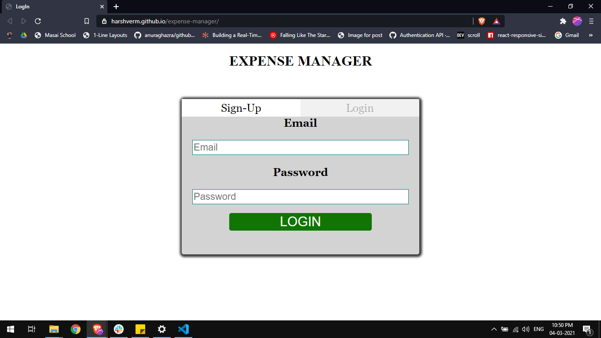
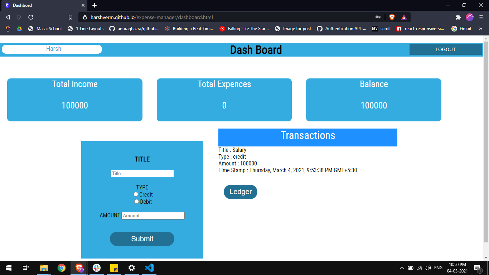
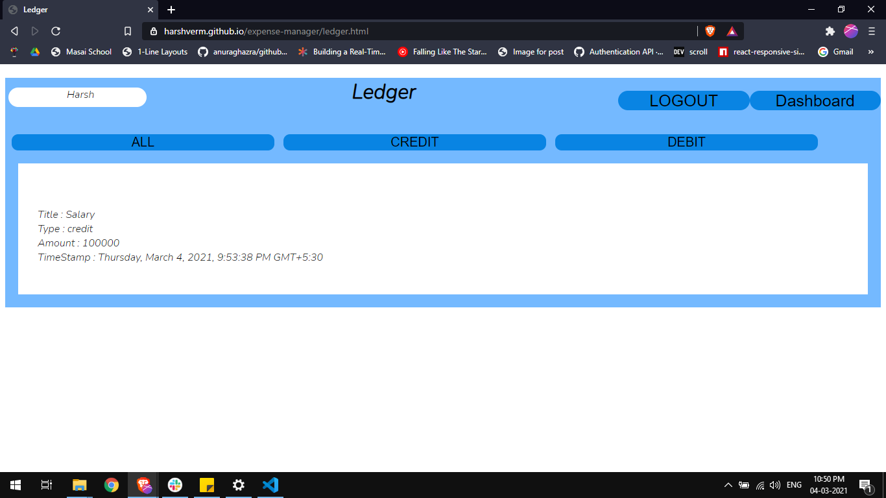

# Expense Manager

<h1 align="center">
  <br>
  
</h1>

<h4 align="center">Website for online expense manager.</h4>

Currency converter is a website which convert USD(US Dollar) in others currency and also check the live or previous exchange value of the currency. 
Expense manager is a web site to manage all the credits and debits.

<h2>SCREENSHOTS</h2>

<h3>Landing Page</h3>



<h3>Dashboard</h3>



<h3>Ledger</h3>




## Built With
- HTML and CSS.
- Javascript.
- Local Storage.


### For developers
Clone the source locally:

```sh
$ https://github.com/HarshVerm/expense-manager.git
```

## License
-HARSH VERMA<br>
-linkdin@[Harsh Verma](https://www.linkedin.com/in/harsh-verma-008371158/) <br>
-gitHub@[HarshVerm](https://github.com/HarshVerm)
